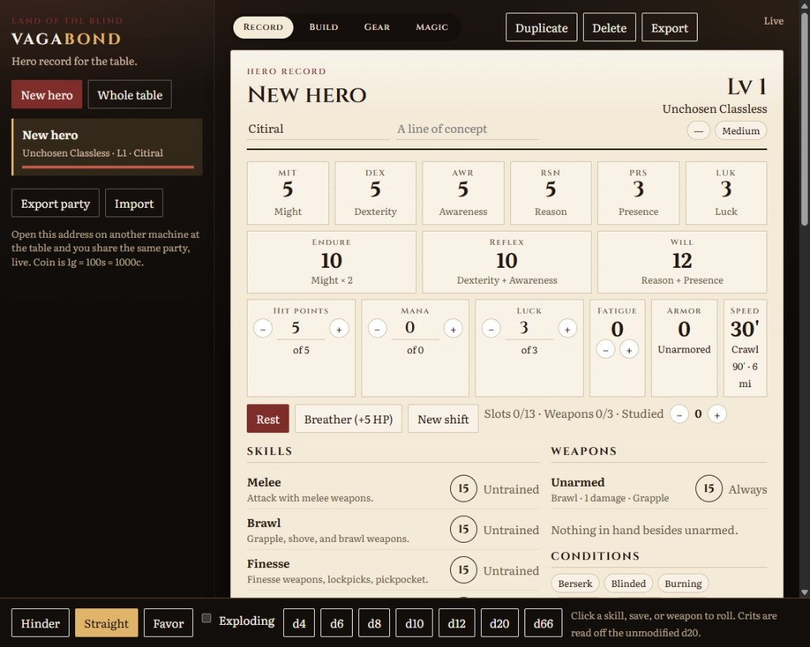

# Vagabond Character Sheet Editor

Extremely vibe coded, and made just for fun to help us in our campaign. Expect rough edges.

A shared character manager for [Vagabond](https://landoftheblind.myshopify.com/collections/vagabond-pulp-fantasy-rpg), the pulp fantasy RPG from Land of the Blind. It builds a hero from ancestry, class, stats, trainings, perks, spells, and gear, then tracks the numbers you touch in play: hit points, mana, luck, fatigue, wealth, and dice.

Open the same address on another machine at the table, sign in, and you share one party, live. New accounts stay closed until the admin approves them at `/admin`. Heroes are saved on the server. With no database configured, they go in a local SQLite file. Set `DATABASE_URL` to use Postgres instead (as on Deno Deploy).

Rules data is original shorthand for use at the table, based on the Core Rulebook v3 alpha 3 preview. It is not a substitute for the book.



## Run

Install [Deno](https://deno.land/), then from this directory:

```sh
deno task start
```

Open http://localhost:8080. The party is stored in `data/vagabond.sqlite`.

Optional environment variables (see `.env.example`):

- `PORT` — listen port, default `8080`
- `DATABASE_URL` — Postgres connection string. When unset, the app uses SQLite.
- `AUTH_SECRET` — long random string that signs login tokens. Required.
- `ADMIN_EMAIL` — the address that is approved on registration and can approve everyone else at `/admin`.

```sh
deno task test
```
